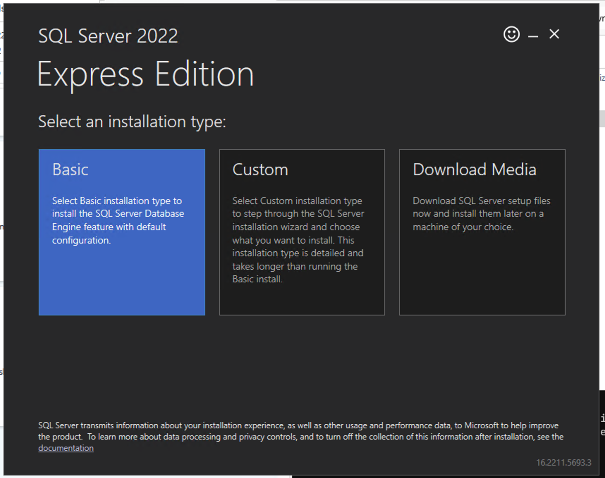
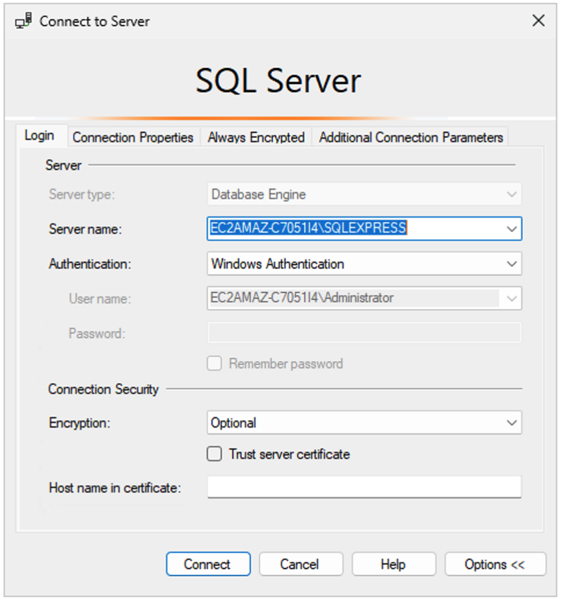
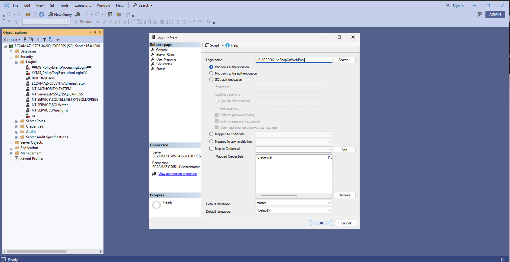
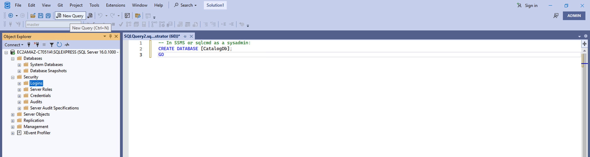
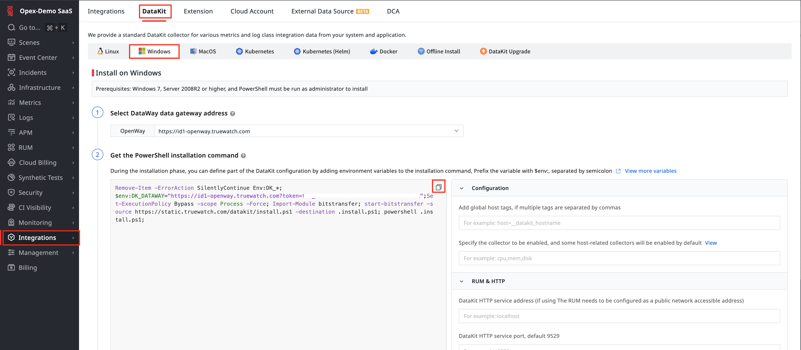
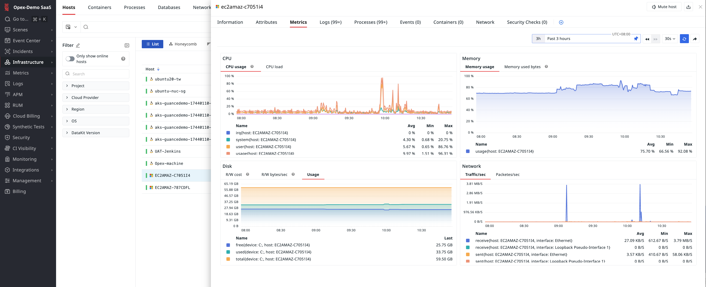
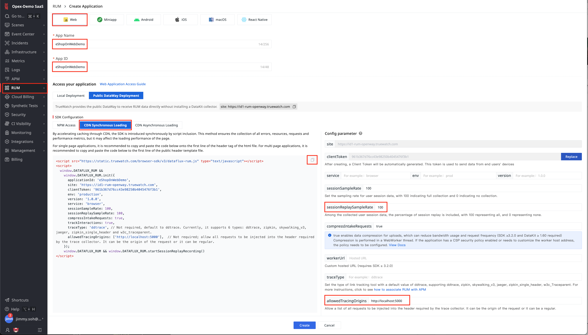
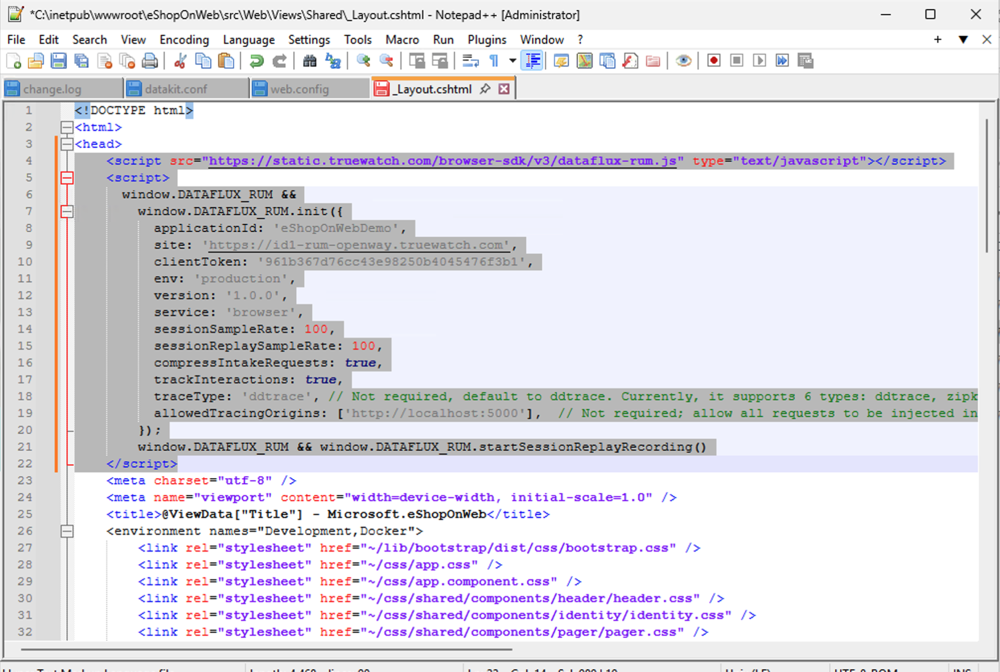
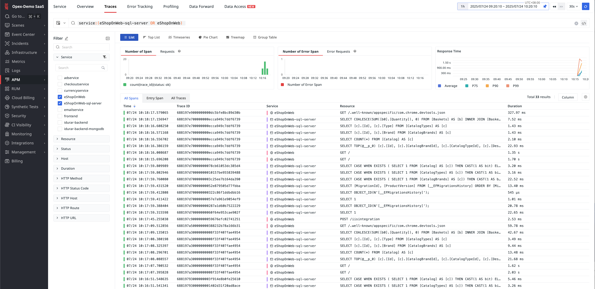

# TrueWatch Workshop: eShopOnWeb Deployment & Instrumentation  
*(Hands-on demo for TrueWatch users & partners)*

---

## Overview & Scope  
This workshop guides you through deploying the **eShopOnWeb** ASP.NET Core 8.0 sample on **Windows IIS** and then instrumenting it with **TrueWatch**.  

- **Part A (Optional)**: Fresh setup of Windows IIS & .NET environment, full application deployment.  
- **Part B**: TrueWatch onboarding and instrumentation for existing IIS apps.  

> **Who should follow which part?**  
> - **New to IIS & .NET?** Start at **Part A**.  
> - **Already have your app on IIS?** Skip Part A and jump to **Part B**.  

---

## 1  Introduction  
By the end of this guide you will have:

* A **published ASP.NET Core 8.0** application (`eShopOnWeb`) hosted by **Windows IIS**  


---

## 2  Environment Prerequisites  

| Requirement                             | Notes                                                            |
|-----------------------------------------|------------------------------------------------------------------|
| **TrueWatch workspace**                 | Register at https://id1-auth.truewatch.com/businessRegister      |
| **Windows Server (e.g., 2025)**                 | On AWS EC2, Parallels, VMware, or bare metal                    |
| **Admin RDP access**                    | Port 3389 open from your IP                                      |

---

## Part A – Environment Setup & Deployment

### A.1 Run PowerShell as Administrator and Install Git and .NET  
```
# Install Git 
winget install --id Git.Git -e --source winget

# Install .NET 8 SDK
winget install --id Microsoft.DotNet.SDK.8 -e

# Relaunch PowerShell as Admin and Verify
git --version
dotnet --version
```

### A.2 Clone & publish the sample  
```powershell
git clone https://github.com/dotnet-architecture/eShopOnWeb.git C:\inetpub\wwwroot\eShopOnWeb
cd C:\inetpub\wwwroot\eShopOnWeb\src\Web

dotnet publish -c Release -o C:\inetpub\wwwroot\eShopOnWeb\publish
```

### A.3 Install and Register AspNetCoreModuleV2  
Download "ASP NET Core Runtime 8.0 Hosting Bundle" from https://dotnet.microsoft.com/download/dotnet/8.0/runtime and save into `C:\Downloads`.

```
# 1. Install silently (as Admin)
Start-Process -FilePath C:\Downloads\dotnet-hosting-8.0.18-win.exe `
  -ArgumentList '/quiet','/norestart' -Wait -Verb RunAs

# 2. Verify registration
Import-Module WebAdministration
Get-WebGlobalModule AspNetCoreModuleV2 | Select Name, Image

# 3. Restart IIS
iisreset /restart
```

### A.4 Create logs directory & ACL  
```powershell
$pub = 'C:\inetpub\wwwroot\eShopOnWeb\publish'
New-Item -ItemType Directory -Path "$pub\logs" -Force
$pool='eShopOnWebPool'
icacls "$pub\logs" /grant "IIS_IUSRS:(M)" /T
```

### A.5 Install the IIS Web Server Role  
```
# Install the full IIS role (Web Server) plus Management tools
Install-WindowsFeature -Name Web-Server -IncludeManagementTools

# Now these should show up and be Running (or Stopped if you haven’t started them yet):
Get-Service W3SVC, WAS | Select-Object Name, Status

# If they’re stopped, start them:
Start-Service WAS
Start-Service W3SVC
```

### A.6 Site & App Pool configuration  
```powershell
Install-WindowsFeature Web-Scripting-Tools -IncludeManagementTools
Import-Module WebAdministration
New-WebAppPool $pool
Set-ItemProperty "IIS:\AppPools\$pool" -Name startMode -Value AlwaysRunning
Set-ItemProperty "IIS:\AppPools\$pool" -Name processModel.loadUserProfile -Value True

New-Website -Name eShopOnWeb `
  -PhysicalPath $pub `
  -Port 5000 -ApplicationPool $pool
```

### A.7 Download and Install SQL Server Express 2022  
Visit https://www.microsoft.com/en-za/sql-server/sql-server-downloads and download SQL Server 2022 Express. Choose the Basic Installation method.



Install SSMS when prompted.

### A.8 Set Up Database  
1. Open SQL Server Management Studio (SSMS)  
     
2. Create a Windows Login  
   - Navigate to **Security** → **Logins**, right-click **New Login…**  
   - **Login name:** `IIS APPPOOL\eShopOnWebPool`  
   - Click **Save**  
     
3. Create **CatalogDb** Database  
   - Select **New Query**  
   - Paste and execute:  
     ```CREATE DATABASE [CatalogDb]; GO```
   

### A.9 Recycle IIS & Verify  
```powershell
iisreset /restart
Invoke-WebRequest http://localhost:5000/ -UseBasicParsing
```
Open `http://localhost:5000/` in your browser — the eShopOnWeb landing page should appear.

---

## Part B – TrueWatch Instrumentation

### B.1 Install TrueWatch DataKit Agent  
- In TrueWatch console: **Integrations → DataKit → Windows**, copy the install script.  
- Run it in PowerShell as Admin.  
- Verify host under **Infrastructure → Hosts**.  
  


### B.2 Enable DataKit Modules  
Edit `C:\Program Files\datakit\conf.d\datakit.conf`:  
```
default_enabled_inputs = ["cpu", "disk", "diskio", "mem", "swap", "system", "hostobject", "net", "host_processes", "dk", "statsd", "ddtrace", "windows_event"]
```
Restart DataKit:  
```
datakit service -R
```

### B.3 Set Up web.config for TrueWatch  

1. Copy the `web.config` file from this repository to `C:\inetpub\wwwroot\eShopOnWeb\src\Web\`

2. Add the following environment variables to the `web.config` file:
```xml
<environmentVariable name="DD_AGENT_HOST" value="127.0.0.1" />
<environmentVariable name="DD_TRACE_AGENT_PORT" value="9529" />
<environmentVariable name="DD_RUNTIME_METRICS_ENABLED" value="1" />
<!-- other DD_ vars as needed -->
```

### B.4 Enable RUM (Real User Monitoring)  
1. In TrueWatch: **RUM → Create Application**, copy snippet.  
2. Edit `_Layout.cshtml` at `C:\inetpub\wwwroot\eShopOnWeb\src\Web\Views\Shared\_Layout.cshtml`, paste under `<head>`.  
  


Publish the changes and restart the app pool:
```powershell
cd C:\inetpub\wwwroot\eShopOnWeb\src\Web
dotnet publish -c Release -o C:\inetpub\wwwroot\eShopOnWeb\publish
Restart-WebAppPool eShopOnWebPool
```

### B.5 Set Up .NET APM Tracing  
1. Install .NET Tracer MSI (e.g., `datadog-dotnet-apm-3.21.0-x64.msi`).  
2. Restart IIS:
```powershell
net stop was; net start w3svc
```  
3. Confirm traces in **TrueWatch APM**  


---


## 3  Additional Notes

### Republishing After Code Changes  
```powershell
cd C:\inetpub\wwwroot\eShopOnWeb\src\Web
dotnet publish -c Release -o C:\inetpub\wwwroot\eShopOnWeb\publish
Restart-WebAppPool eShopOnWebPool
```

*© 2025 TrueWatch Demo Workshop*